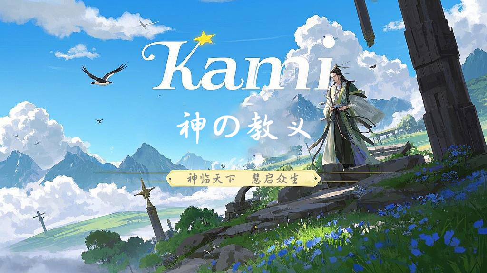

<br/>
<br/>
<h1 align="center">Kami 神の教义</h1>
<h2 align="center">🧚‍♂️知以藏往，是往有常也🕌</h2>
<h4 align="center">👩‍👩‍👧‍👦人 人 都 在 用 的 简 约 文 档⛩️</h4>
<h3 align="center">️点赞！⭐收藏！💬评论！🌟给个小星星！</h3>
<h3 align="center">☕请喝咖啡~</h3>


<div align="center">

[博 客](https://jogjo.cn) |
[Q Q](https://qm.qq.com/q/YxdGW0bGYC) |
[微 信](https://u.wechat.com/EKFJ-MWA3mXm_UZSdcKBJjg?s=2)

[](https://gitee.com/jogjo/kami)
[](https://github.com/jogjo/kami)
[](https://gitee.com/jogjo/kami)
[](https://gitcode.com/jogjo/kami/overview)
[](https://jogjo.cn)

遇见Kami，是神的旨意


 </div>

# 介绍
Kami Doctrine 神の教义，是基于Vitepress的文档项目模板。将常用的繁琐配置固化，方便快速搭建一个多语言文档项目，让使用者更专注于写作！

特点：

- 极简配置，快速搭建
- 多语言支持，支持中文、英文（可自行扩展）
- 适配移动端
- 适配暗黑模式
- 编译后纯前端静态发布

无需服务器部署，书写人生、随笔，轻松搞定！

PS：百年之后，我们的服务器会到期，我们的域名会到期，努力的痕迹都会消失，静态网页才是普通人的最后归宿。

# 使用

## 启动
```
# 克隆项目
git clone https://github.com/jogjo/kami-doc.git

# 国内可以使用gitee
git clone https://gitee.com/jogjo/kami-doc.git

# 进入项目目录，或者使用VSCode打开
cd kami-doc

# 安装依赖
pnpm install

# 启动服务
pnpm docs:dev

# 打包
pnpm docs:build

# 部署
无需服务器，将dist文件部署成静态网页即可，方式很多，可以自行选择


```
## 写作
项目启动后，默认包含一份使用文档，请阅读使用文档，快速上手。

## 功能规划


- 左侧菜单自动根据文档目录生成（目前左侧菜单需要手动配置，稍显麻烦）
- 文档加密功能（需要输入密码访问）
- 文档时间限制访问功能（指定时间段可访问）


# 结语
觉得Kami-doc符合你的使用需求和体验，请尽情使用！也欢迎留下你的项目链接，我们一起交流。



<div align="center">书写你的故事，回忆世间！</div>


# 天神榜
感谢各位天神的馈赠！

<table>
  <tr>
    <td></td>
  </tr>
  <tr>
    <td align="center"><a href="https://jogjo.cn" title="这是JogJo的博客，走过路过不要错过哟~" target="_blank">JogJo</a></td>
  </tr>
  <tr>
    <td align="center">¥ 777</td>
  </tr>
</table>

# 贡献者
感谢各位大佬的贡献！

<a href="https://github.com/jogjo/kami-doc/graphs/contributors">
  
</a>

# 神の名录
感谢使用kami架构的用户、组织，欢迎留名！

<table>
  <tr>
    <td></td>
  </tr>
  <tr>
    <td align="center"><a href="https://jogjo.cn" title="这是JogJo的博客，走过路过不要错过哟~" target="_blank">JogJo</a></td>
  </tr>
</table>

# 互动交流
如果觉得kami架构符合你的使用需求和体验，请尽情使用！也欢迎留下你的项目链接，我们一起交流。

格式：
> 名称：JogJo
>
> 描述：这是JogJo的博客，走过路过不要错过哟~
>
> 链接：https://jogjo.cn
>
> 图片：可以是一个链接、或者具体图片

发送到邮箱：jogjo@qq.com

<a href="https://star-history.com/#jogjo/kami-doc&Date">
  
</a>

# 请作者喝咖啡

---


<div align="center" style="color: rgb(234,94,67);text-align: center">
*你随手赞助的咖啡会让人兴奋得睡不着觉，一拍大腿！又出一个新功能！*
</div>

---

欢迎大家来博客反馈，在[树洞]可以匿名反馈，在[微聊]博主可以实时收到反馈消息，夜深人静的时候注意点，咳咳~

---